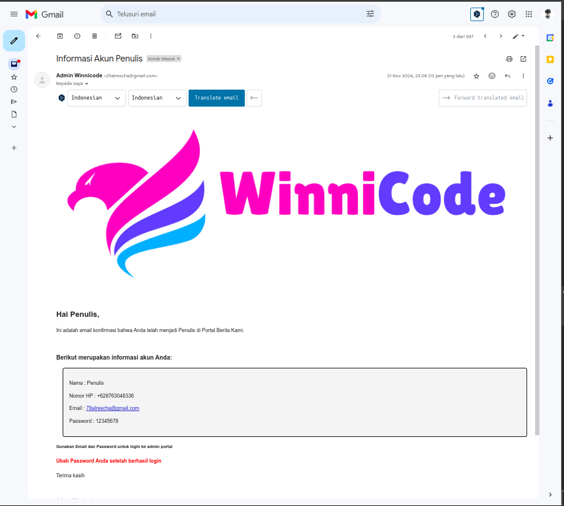

# Portal Berita Fullstack

## Proyek Akhir Magang Mandiri di Winnicode Garuda Teknologi

### **Deskripsi**

Proyek ini merupakan sebuah portal berita fullstack yang dibangun menggunakan teknologi terkini. Aplikasi ini memungkinkan pengguna untuk mengakses berita terbaru, serta menyediakan dashboard bagi admin untuk mengelola konten.

### **Teknologi yang Digunakan**

* **Frontend:** Astro, React, Tailwind CSS
* **Dashboard:** React, CoreUI
* **Backend:** Node.js, Express.js, Firebase
* **Database:** Firestore Database
* **Authentication:** Firebase Auth

### **Fitur Utama**

* **Halaman Berita:** Menampilkan berita terbaru, menampilkan berita per kategori.
* **Dashboard Admin:** Mengelola berita, penulis, dan kategori.
* **Autentikasi Admin:** Menggunakan Firebase Authentication untuk mengatur login dan registrasi Admin & Penulis.
* **Penyimpanan Data:** Menggunakan Firestore Database dan Google Cloud Storage untuk menyimpan data berita, pengguna, dan lainnya.

### **Cara Menjalankan**

#### **Prasyarat**

* Node.js dan npm (atau yarn) telah terinstal
* Akun Firebase
* Postman (untuk testing API)

#### **Langkah-langkah**

1. **Clone Repository:**

   ```bash
   https://github.com/alrescha79-cmd/portal-berita.git
   ```

2. **Setup Firebase:**
   * Buat project baru di Firebase Console.
   * Tambahkan aplikasi web baru.
   * Aktifkan Firestore Database dan Authentication.
   * Unduh `google-services.json` dan simpan di direktori `backend` dan `dashboard`.
   * Sesuaikan nilai `API_KEY`, `AUTH_DOMAIN`, dan lainnya pada file `.env` di masing-masing direktori dengan nilai yang sesuai dari Firebase project Anda.

3. **Jalankan Aplikasi:**

   * **Backend:**

        * pindah ke folder `backend`

     ```bash
     cd backend
     ```

        * install semua package

     ```bash
     npm i
     ```

        * **Tambahkan `.env` di root folder backend**

        * Sesuaikan dengan key dari `Firebase`

            ```env
            API_KEY=****************
            AUTH_DOMAIN=****************
            PROJECT_ID=****************
            STORAGE_BUCKET=****************
            MESSAGING_SENDER_ID=****************
            APP_ID=****************
            URL_LOGIN=****************

            EMAIL=****************
            EMAIL_PASSWORD=****************
            ```

        * Jangan lupa download `google-services.json` dari Firebase dan masukkan ke root folder `backend`

        * Jalankan Project

     ```bash
     npm run dev
     ```

     * Secara default, Server akan berjalan pada <http://localhost:3000>

     ##

   * **Dashboard:**

        * pindah ke folder `dashboard`

     ```bash
     cd dashboard
     ```

        * install semua package

     ```bash
     npm i
     ```

        * **Tambahkan `.env` di root folder dashboard**

        * Sesuaikan dengan key dari `Firebase`

        ```env
        VITE_API_KEY=**********
        VITE_AUTH_DOMAIN==**********
        VITE_PROJECT_ID==**********
        VITE_STORAGE_BUCKET==**********
        VITE_MESSAGING_SENDER_ID==**********
        VITE_APP_ID==**********

        VITE_API=http://localhost:3000 # ganti sesuai dengan url backend
        ```

        * Jangan lupa download `google-services.json` dari Firebase dan masukkan ke root folder `dashboard`

        * Jalankan Project

     ```bash
     npm run dev
     ```

     * Secara default, Server akan berjalan pada <http://localhost:5000>

    ##

   * **Frontend:**

        * pindah ke folder `frontend`

        ```bash
        cd frontend
        ```

        * install semua package

        ```bash
        npm i
        ```

        * **Tambahkan `.env` di root folder frontend**

            ```env
            HOST=<url-backend>
            LOCAL_HOST=http://localhost:3000
            ```

        * Jalankan Project

        ```bash
        npm run dev
        ```

        * Secara default, Server akan berjalan pada <http://localhost:4321>

    ##

4. **Testing API:**
   * Gunakan Postman collection yang disediakan untuk menguji API backend.

## Postman Collection

Gunakan `postman collection`berikut untuk testing API pada `backend`

[Project_Internship_Winnicode.postman_collection.json](https://drive.google.com/file/d/1SXqXUH2vUllWS_WblsGCDuXjHIjtUS5A/view?usp=drive_link)

### **Struktur Direktori**

```root
portal-berita
├── backend
├── dashboard
└── frontend
```

### **Screenshoot**

* **Performa Aplikasi**


* **Email Konfirmasi Penulis Baru**


### **Demo**

* **Link API:** [https://winnicode-165414826026.asia-southeast2.run.app](https://news-app-api-165414826026.asia-southeast2.run.app)
* **Link Berita:** [https://winnicode-165414826026.asia-southeast2.run.app](https://winnicode-165414826026.asia-southeast2.run.app)
* **Link Dashborad:** [https://news-app-dashboard-165414826026.asia-southeast2.run.app](https://news-app-dashboard-165414826026.asia-southeast2.run.app)

#### Login Admin Dashboard

**Email:**

```email
admin@winnicode.com
```

**password:**

```pass
12345678
```

> [!CAUTION]
> Hanya untuk keperluan Demo, Jangan gunakan untuk hal yang tidak baik!

### **Kontribusi**

Kontribusi sangat diapresiasi! Silahkan buat pull request jika Anda ingin menambahkan fitur baru atau memperbaiki bug.

### **Penulis**

* **Anggun Caksono** - [https://cakson.my.id](https://cakson.my.id)

## **Repository utama**

> [!NOTE]  
> Semua riwayat dan Commit.

[https://github.com/alrescha79-cmd/project-internship-winnicode-fullstack](https://github.com/alrescha79-cmd/project-internship-winnicode-fullstack)
